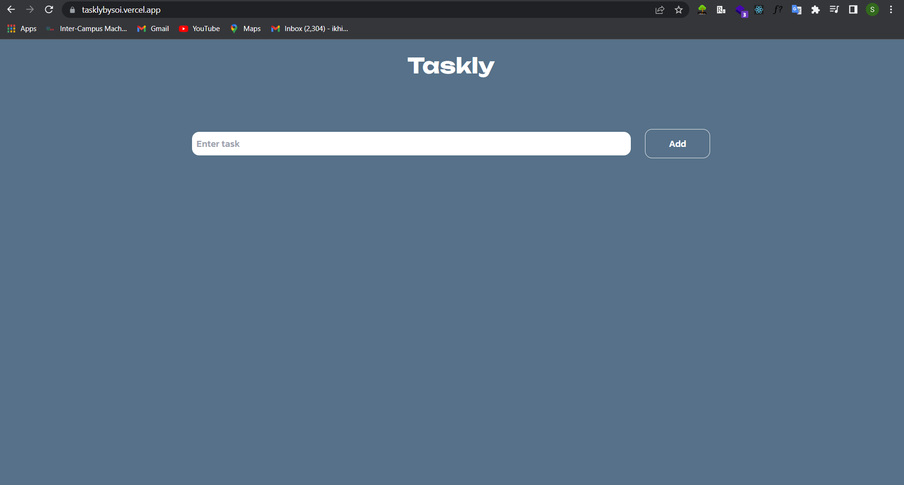

# Taskly By Soi

This is a to-do application built using react.js, typescript, and tailwind css.

## Table of contents

- [Overview](#overview)
  - [Screenshot](#screenshot)
  - [Links](#links)
  - [Built with](#built-with)
  - [What I learned](#what-i-learned)
- [Author](#author)

## Overview

This is a mini todo application built using react.js, typescript and tailwind css. Users can add new tasks
to the already created tasks, and also delete. They can also mark a created task as done.

### Screenshot

### Links

- Solution URL: (https://github.com/Generalsoi/taskly)
- Live Site URL: (https://tasklybysoi.vercel.app/)

### Built with

- Tailwind CSS
- [React](https://reactjs.org/) - JS library
- Typescript

### What I learned

I majorly learned how to declare types in typescript

## Author

- Website - [Success Ikhinobele](https://www.github.com/Generalsoi)
- Twitter - [@Successsoi1](https://www.twitter.com/Successsoi1)
